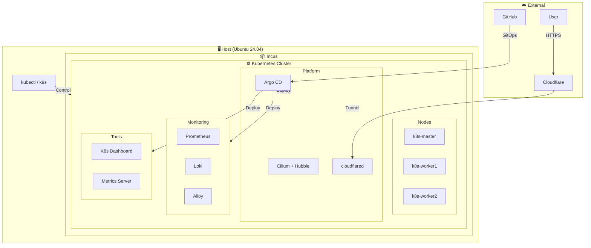

# kotarnetes

kota + kubernetes = kotarnetes

## システム要件

Ubuntu 24.04

## 技術スタック

### インフラ

- Incus
- Kubernetes (v1.34)
- Cilium (CNI + Ingress Controller)
- Hubble

### GitOps

- Argo CD
- Helm

### シークレット管理

- External Secrets Operator
- Bitwarden Secrets Manager
- cert-manager

### モニタリング

- Prometheus
- Loki
- Alloy

### ツール

- Kubernetes Dashboard
- Metrics Server
- kubectl
- k9s
- cloudflared

## アーキテクチャ



## セットアップ

### 1. VMの作成

```bash
sh scripts/vm.sh
newgrp incus-admin
```

Incusがインストールされ、cloud-initを使用して以下のVMが作成される

- k8s-master
- k8s-worker1
- k8s-worker2

### 2. k8sクラスターの作成

```sh
sh scripts/k8s.sh
```

このスクリプトは以下を実行する

1. Kubernetesクラスタの初期化
2. Cilium CNI + Hubbleのインストール
3. Argo CDのインストール
4. ホストへのkubectl/k9sのインストール
5. Argo CD root applicationの適用（GitOpsによるアプリデプロイ開始）

### 3. GitOpsによるアプリケーションデプロイ

Argo CDが自動的に以下のアプリケーションをデプロイする

- Prometheus
- Loki
- Alloy
- Kubernetes Dashboard
- Metrics Server

設定を変更したい場合は `manifests/` 以下のファイルを編集してGitにpushする

### 4. シークレット管理の設定（Bitwarden Secrets Manager）

External Secrets Operator (ESO) + Bitwarden Secrets Managerでシークレットを管理する

#### 4.1 Bitwarden側の準備

1. [Bitwarden Secrets Manager](https://bitwarden.com/products/secrets-manager/)でプロジェクトを作成
2. 以下のシークレットを作成
   - `cloudflare-tunnel-token`: Cloudflare Tunnelトークン
3. Machine Accountを作成し、プロジェクトへのアクセス権限を付与
4. Access Tokenを取得

#### 4.2 ClusterSecretStoreの設定

ExternalSecretマニフェストを編集してBitwardenのシークレットIDを設定:

```bash
# 1. ClusterSecretStoreの設定
#    manifests/external-secrets/store/cluster-secret-store.yaml
#    - organizationID: Bitwarden組織ID
#    - projectID: BitwardenプロジェクトID

# 2. ExternalSecretの設定
#    manifests/external-secrets/secrets/*.yaml
#    - remoteRef.key: 各シークレットのBitwarden ID
```

#### 4.3 初回デプロイ

```bash
# 1. namespaceを作成
kubectl create namespace external-secrets

# 2. Bitwarden Access TokenをSecretとして投入（初回のみ）
kubectl create secret generic bitwarden-access-token \
  --namespace external-secrets \
  --from-literal=token=<YOUR_BWS_ACCESS_TOKEN>

# 3. GitにpushしてArgo CDでデプロイ
git push
```

#### 4.4 デプロイ順序（sync-wave）

ESO関連リソースは以下の順序でデプロイされる:

| Wave | リソース | 説明 |
|------|----------|------|
| -5 | cert-manager | TLS証明書管理 |
| -4 | External Secrets Operator | CRDとオペレーター |
| -3 | bitwarden-sdk-server | gRPCプロキシ（TLS対応） |
| -2 | ClusterSecretStore | Bitwarden接続設定 |
| -1 | ExternalSecret | K8s Secret生成 |
| 1 | valkey, rustfs, cloudflared | アプリケーション |

### 5. Cloudflare Tunnelの設定

External Secrets経由で自動的にシークレットが作成されるため、手動でのSecret作成は不要

```bash
# Cloudflare Dashboardでトンネルを作成
# https://one.dash.cloudflare.com/ → Zero Trust → Networks → Tunnels
# 「Create a tunnel」からトンネルを作成し、トークンを取得
# → Bitwarden Secrets Managerに登録
```

## アクセス情報

### Argo CD

#### Cloudflare Tunnel

- URL: Cloudflare Dashboardで設定したホスト名（例: `https://argocd.example.com`）
- Username: admin
- Password: `kubectl -n argocd get secret argocd-initial-admin-secret -o jsonpath='{.data.password}' | base64 -d`

#### ローカルアクセス

```bash
kubectl port-forward svc/argocd-server -n argocd 8080:443
```

- URL: https://localhost:8080

### Kubernetes Dashboard

```bash
kubectl port-forward -n kubernetes-dashboard svc/kubernetes-dashboard-kong-proxy 8443:443
```

- URL: https://localhost:8443

### Hubble UI

```bash
kubectl port-forward -n kube-system svc/hubble-ui 12000:80
```

- URL: http://localhost:12000

## 運用

### 設定を変更する

例：Lokiのレプリカ数を変更したい場合

```bash
# 1. valuesファイルを編集
vim manifests/monitoring/loki-values.yaml

# 2. コミットしてプッシュ
git add .
git commit -m "Update loki replicas"
git push

# 3. Argo CDが自動で検知して反映
#    すぐに反映したい場合は手動Sync
kubectl exec -n argocd deploy/argocd-server -- argocd app sync loki
```

### 新しいアプリを追加する

`manifests/apps/my-app.yaml` の例

```yaml
apiVersion: argoproj.io/v1alpha1
kind: Application
metadata:
  name: my-app
  namespace: argocd
  finalizers:
    - resources-finalizer.argocd.argoproj.io
spec:
  project: default
  sources:
    - repoURL: https://example.com/helm-charts  # Helmリポジトリ
      chart: my-app
      targetRevision: "*"
      helm:
        valueFiles:
          - $values/manifests/my-app/values.yaml
    - repoURL: https://github.com/yashikota/kotarnetes.git
      targetRevision: main
      ref: values
  destination:
    server: https://kubernetes.default.svc
    namespace: my-app
  syncPolicy:
    automated:
      prune: true
      selfHeal: true
    syncOptions:
      - CreateNamespace=true
```

```bash
mkdir -p manifests/my-app
vim manifests/my-app/values.yaml
```

```bash
git add .
git commit -m "Add my-app"
git push
```

### クラスタの再作成

#### VMからやり直す場合

```bash
incus stop k8s-master k8s-worker1 k8s-worker2 && incus delete k8s-master k8s-worker1 k8s-worker2
sh scripts/vm.sh
newgrp incus-admin
sh scripts/k8s.sh
```

#### Kubernetesだけやり直す場合

```bash
incus exec k8s-master -- kubeadm reset -f
incus exec k8s-worker1 -- kubeadm reset -f
incus exec k8s-worker2 -- kubeadm reset -f
sh scripts/k8s.sh
```
