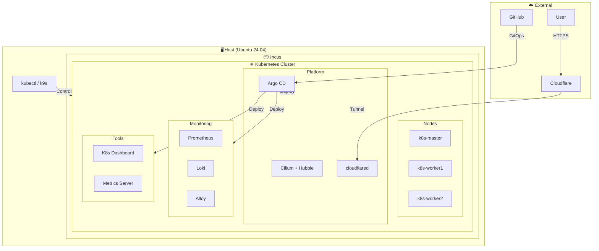

# kotarnetes

kota + kubernetes = kotarnetes

## システム要件

Ubuntu 24.04

## 技術スタック

### インフラ

- Incus
- Kubernetes (v1.34)
- Cilium (CNI + Ingress Controller)
- Hubble

### GitOps

- Argo CD
- Helm

### モニタリング

- Prometheus
- Loki
- Alloy

### ツール

- Kubernetes Dashboard
- Metrics Server
- kubectl
- k9s
- cloudflared

## アーキテクチャ



## セットアップ

### 1. VMの作成

```bash
sh scripts/vm.sh
newgrp incus-admin
```

Incusがインストールされ、cloud-initを使用して以下のVMが作成される

- k8s-master
- k8s-worker1
- k8s-worker2

### 2. k8sクラスターの作成

```sh
sh scripts/k8s.sh
```

このスクリプトは以下を実行する

1. Kubernetesクラスタの初期化
2. Cilium CNI + Hubbleのインストール
3. Argo CDのインストール
4. ホストへのkubectl/k9sのインストール
5. Argo CD root applicationの適用（GitOpsによるアプリデプロイ開始）

### 3. GitOpsによるアプリケーションデプロイ

Argo CDが自動的に以下のアプリケーションをデプロイする

- Prometheus
- Loki
- Alloy
- Kubernetes Dashboard
- Metrics Server

設定を変更したい場合は `manifests/` 以下のファイルを編集してGitにpushする

### 4. Cloudflare Tunnelの設定

外部からArgo CD等にアクセスするためのTunnelを設定する

```bash
# 1. Cloudflare Dashboardでトンネルを作成
#    https://one.dash.cloudflare.com/ → Zero Trust → Networks → Tunnels
#    「Create a tunnel」からトンネルを作成し、トークンを取得

# 2. namespaceを作成
kubectl create namespace cloudflared

# 3. トークンをSecretとして保存
kubectl create secret generic cloudflared-tunnel \
  --namespace cloudflared \
  --from-literal=token=<YOUR_TUNNEL_TOKEN>

# 4. GitにpushしてArgo CDでデプロイ
git push
```

## アクセス情報

### Argo CD

#### Cloudflare Tunnel

- URL: Cloudflare Dashboardで設定したホスト名（例: `https://argocd.example.com`）
- Username: admin
- Password: `kubectl -n argocd get secret argocd-initial-admin-secret -o jsonpath='{.data.password}' | base64 -d`

#### ローカルアクセス

```bash
kubectl port-forward svc/argocd-server -n argocd 8080:443
```

- URL: https://localhost:8080

### Kubernetes Dashboard

```bash
kubectl port-forward -n kubernetes-dashboard svc/kubernetes-dashboard-kong-proxy 8443:443
```

- URL: https://localhost:8443

### Hubble UI

```bash
kubectl port-forward -n kube-system svc/hubble-ui 12000:80
```

- URL: http://localhost:12000

## 運用

### 設定を変更する

例：Lokiのレプリカ数を変更したい場合

```bash
# 1. valuesファイルを編集
vim manifests/monitoring/loki-values.yaml

# 2. コミットしてプッシュ
git add .
git commit -m "Update loki replicas"
git push

# 3. Argo CDが自動で検知して反映
#    すぐに反映したい場合は手動Sync
kubectl exec -n argocd deploy/argocd-server -- argocd app sync loki
```

### 新しいアプリを追加する

`manifests/apps/my-app.yaml` の例

```yaml
apiVersion: argoproj.io/v1alpha1
kind: Application
metadata:
  name: my-app
  namespace: argocd
  finalizers:
    - resources-finalizer.argocd.argoproj.io
spec:
  project: default
  sources:
    - repoURL: https://example.com/helm-charts  # Helmリポジトリ
      chart: my-app
      targetRevision: "*"
      helm:
        valueFiles:
          - $values/manifests/my-app/values.yaml
    - repoURL: https://github.com/yashikota/kotarnetes.git
      targetRevision: main
      ref: values
  destination:
    server: https://kubernetes.default.svc
    namespace: my-app
  syncPolicy:
    automated:
      prune: true
      selfHeal: true
    syncOptions:
      - CreateNamespace=true
```

```bash
mkdir -p manifests/my-app
vim manifests/my-app/values.yaml
```

```bash
git add .
git commit -m "Add my-app"
git push
```

### クラスタの再作成

#### VMからやり直す場合

```bash
incus stop k8s-master k8s-worker1 k8s-worker2 && incus delete k8s-master k8s-worker1 k8s-worker2
sh scripts/vm.sh
newgrp incus-admin
sh scripts/k8s.sh
```

#### Kubernetesだけやり直す場合

```bash
incus exec k8s-master -- kubeadm reset -f
incus exec k8s-worker1 -- kubeadm reset -f
incus exec k8s-worker2 -- kubeadm reset -f
sh scripts/k8s.sh
```
