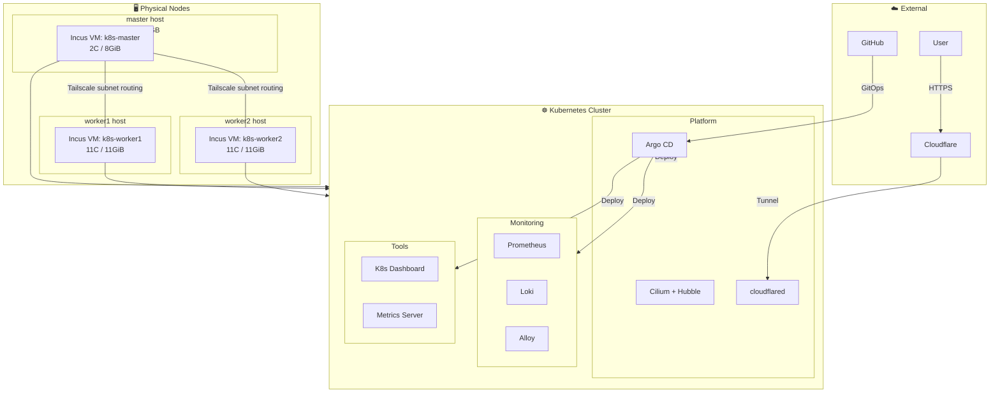

# kotarnetes

kota + kubernetes = kotarnetes

## システム要件

| ホスト | CPU | メモリ | 用途 | VM割り当て |
|--------|-----|--------|------|-----------|
| master | 4コア | 15GB | control-plane | 2コア / 8GiB |
| worker1 | 12コア | 12GB | ワークロード専用 | 11コア / 11GiB |
| worker2 | 12コア | 12GB | ワークロード専用 | 11コア / 11GiB |

- OS: Ubuntu系ディストリビューション
- 各物理ホストに Tailscale セットアップ済み
- sudo 権限

## 技術スタック

### インフラ

- Incus（VM管理）
- Kubernetes (v1.34)
- Cilium (CNI + Ingress Controller)
- Hubble

### GitOps

- Argo CD
- Helm

### シークレット管理

- External Secrets Operator
- Bitwarden Secrets Manager
- cert-manager

### モニタリング

- Prometheus
- Loki
- Alloy
- Mackerel（物理ホストヘルスチェック）

### ツール

- Kubernetes Dashboard
- Metrics Server
- kubectl / k9s
- cloudflared

## アーキテクチャ

物理3台の各ホスト上に Incus VM を1台ずつ作成し、VM 内に Kubernetes を閉じ込める。
VM 間の通信は物理ホストの Tailscale subnet routing で接続する。


```mermaid
flowchart TB
    subgraph External["☁️ External"]
        GitHub["GitHub"]
        Cloudflare["Cloudflare"]
        User["User"]
    end

    subgraph Physical["🖥️ Physical Nodes"]
        subgraph Host1["master host<br/>4C / 15GB"]
            VM1["Incus VM: k8s-master<br/>2C / 8GiB"]
        end
        subgraph Host2["worker1 host<br/>12C / 12GB"]
            VM2["Incus VM: k8s-worker1<br/>11C / 11GiB"]
        end
        subgraph Host3["worker2 host<br/>12C / 12GB"]
            VM3["Incus VM: k8s-worker2<br/>11C / 11GiB"]
        end
    end

    subgraph K8s["☸️ Kubernetes Cluster"]
        subgraph Platform["Platform"]
            Cilium["Cilium + Hubble"]
            ArgoCD["Argo CD"]
            Cloudflared["cloudflared"]
        end

        subgraph Monitoring["Monitoring"]
            Prometheus["Prometheus"]
            Loki["Loki"]
            Alloy["Alloy"]
        end

        subgraph Tools["Tools"]
            Dashboard["K8s Dashboard"]
            Metrics["Metrics Server"]
        end
    end

    VM1 ---|Tailscale subnet routing| VM2
    VM1 ---|Tailscale subnet routing| VM3
    VM1 --> K8s
    VM2 --> K8s
    VM3 --> K8s
    User -->|HTTPS| Cloudflare
    Cloudflare -->|Tunnel| Cloudflared
    GitHub -->|GitOps| ArgoCD
    ArgoCD -->|Deploy| Platform
    ArgoCD -->|Deploy| Monitoring
    ArgoCD -->|Deploy| Tools
```

## セットアップ

### 1. 前提

3台の物理ホストを用意し、各ホストで Tailscale に参加しておく。
Kubernetes や containerd などの変更は VM 内に閉じ込めるため、物理ホストの環境は汚れない。

### 2. VM の作成

各物理ホストで role を指定して実行する。リポジトリはホスト上に clone しておく。

```sh
git clone https://github.com/yashikota/kotarnetes.git
cd kotarnetes

# master 用ホスト
sh scripts/vm.sh master

# worker1 用ホスト
sh scripts/vm.sh worker1

# worker2 用ホスト
sh scripts/vm.sh worker2
```

`vm.sh` は以下を行う。

1. Incus のインストールと初期化
2. role に応じた CPU / メモリで VM を作成
3. ホストの IPv4 forwarding と iptables を設定
4. Tailscale subnet route の受信と広告を有効にするコマンドを表示

スクリプト完了後、表示された subnet route を各ホストで広告し、他ホストの subnet route も受信する。

```sh
sudo tailscale set --accept-routes=true --advertise-routes=<VM_SUBNET> --snat-subnet-routes=false
```

Tailscale 管理画面で route approval が必要な場合は承認する。

### 3. master VM のセットアップ

```sh
sudo incus exec k8s-master -- rm -rf /root/kotarnetes
sudo incus exec k8s-master -- mkdir -p /root/kotarnetes
sudo incus file push -r ./ k8s-master/root/kotarnetes/
sudo incus exec k8s-master -- sh /root/kotarnetes/scripts/k8s.sh master
```

`k8s.sh master` は以下を実行する。

1. ノード共通設定（swap 無効化、カーネルモジュール、containerd、kubeadm / kubelet / kubectl 導入）
2. VM IP を使った control-plane の初期化
3. Cilium CNI + Hubble のインストール
4. Helm / Argo CD のインストール
5. k9s のインストール
6. Argo CD root application の適用（GitOps 開始）
7. worker 参加用の `kubeadm join` コマンドを表示

### 4. worker VM の参加

master 完了時に表示されたコマンドを各 worker VM で実行する。

```sh
# worker1
sudo incus exec k8s-worker1 -- rm -rf /root/kotarnetes
sudo incus exec k8s-worker1 -- mkdir -p /root/kotarnetes
sudo incus file push -r ./ k8s-worker1/root/kotarnetes/
sudo incus exec k8s-worker1 -- sh /root/kotarnetes/scripts/k8s.sh worker 'kubeadm join ...'

# worker2
sudo incus exec k8s-worker2 -- rm -rf /root/kotarnetes
sudo incus exec k8s-worker2 -- mkdir -p /root/kotarnetes
sudo incus file push -r ./ k8s-worker2/root/kotarnetes/
sudo incus exec k8s-worker2 -- sh /root/kotarnetes/scripts/k8s.sh worker 'kubeadm join ...'
```

worker VM 内に入って直接実行する場合は、同じ join コマンドを次の形で実行する。

```sh
cd /root/kotarnetes
sh scripts/k8s.sh worker 'kubeadm join ...'
```

セットアップ後の確認。

```sh
sudo incus exec k8s-master -- kubectl --kubeconfig /etc/kubernetes/admin.conf get nodes -o wide
sudo incus exec k8s-master -- kubectl --kubeconfig /etc/kubernetes/admin.conf get pods -A
```

### 5. シークレット管理（Bitwarden Secrets Manager）

External Secrets Operator (ESO) + Bitwarden Secrets Manager でシークレットを管理する。

#### 5.1 Bitwarden 側の準備

1. [Bitwarden Secrets Manager](https://bitwarden.com/products/secrets-manager/) でプロジェクトを作成
2. シークレットを作成（例: `cloudflare-tunnel-token`）
3. Machine Account を作成し、プロジェクトへのアクセス権限を付与
4. Access Token を取得

#### 5.2 マニフェストの設定

```bash
# ClusterSecretStore
#   manifests/external-secrets/store/cluster-secret-store.yaml
#   - organizationID: Bitwarden 組織 ID
#   - projectID: Bitwarden プロジェクト ID

# ExternalSecret
#   manifests/external-secrets/secrets/*.yaml
#   - remoteRef.key: 各シークレットの Bitwarden ID
```

#### 5.3 初回デプロイ

```bash
kubectl create namespace external-secrets

kubectl create secret generic bitwarden-access-token \
  --namespace external-secrets \
  --from-literal=token=<YOUR_BWS_ACCESS_TOKEN>

git push
```

#### 5.4 デプロイ順序（sync-wave）

| Wave | リソース | 説明 |
|------|----------|------|
| -5 | cert-manager | TLS 証明書管理 |
| -4 | External Secrets Operator | CRD とオペレーター |
| -3 | bitwarden-sdk-server | gRPC プロキシ（TLS 対応） |
| -2 | ClusterSecretStore | Bitwarden 接続設定 |
| -1 | ExternalSecret | K8s Secret 生成 |
| 1 | valkey, rustfs, cloudflared | アプリケーション |

### 6. Cloudflare Tunnel の設定

External Secrets 経由で自動的にシークレットが作成されるため、手動での Secret 作成は不要。

1. [Cloudflare Zero Trust](https://one.dash.cloudflare.com/) → Networks → Tunnels でトンネルを作成
2. トークンを Bitwarden Secrets Manager に登録

## アクセス情報

### Argo CD

```bash
# ローカルアクセス
kubectl port-forward svc/argocd-server -n argocd 8080:443
# URL: https://localhost:8080
# Username: admin
# Password:
kubectl -n argocd get secret argocd-initial-admin-secret -o jsonpath='{.data.password}' | base64 -d
```

Cloudflare Tunnel 経由の場合は Dashboard で設定したホスト名でアクセスする。

### Headlamp

```bash
# 物理ホストからアクセス
sudo incus exec k8s-master -- kubectl --kubeconfig /etc/kubernetes/admin.conf -n headlamp port-forward --address 0.0.0.0 svc/headlamp 4466:80
# URL: http://10.210.1.141:4466

# ログイン用 token
sudo incus exec k8s-master -- sh -lc 'kubectl --kubeconfig /etc/kubernetes/admin.conf -n kube-system create serviceaccount headlamp-admin --dry-run=client -o yaml | kubectl --kubeconfig /etc/kubernetes/admin.conf apply -f -'
sudo incus exec k8s-master -- sh -lc 'kubectl --kubeconfig /etc/kubernetes/admin.conf create clusterrolebinding headlamp-admin-cluster-admin --clusterrole=cluster-admin --serviceaccount=kube-system:headlamp-admin --dry-run=client -o yaml | kubectl --kubeconfig /etc/kubernetes/admin.conf apply -f -'
sudo incus exec k8s-master -- kubectl --kubeconfig /etc/kubernetes/admin.conf -n kube-system create token headlamp-admin
```

### Hubble UI

```bash
kubectl port-forward -n kube-system svc/hubble-ui 12000:80
# URL: http://localhost:12000
```

## 運用

### 設定を変更する

```bash
vim manifests/monitoring/loki-values.yaml
git add manifests/monitoring/loki-values.yaml
git commit -m "Update loki replicas"
git push
# Argo CD が自動で検知して反映
# すぐに反映したい場合は手動 Sync
kubectl exec -n argocd deploy/argocd-server -- argocd app sync loki
```

### 新しいアプリを追加する

`manifests/apps/my-app.yaml` を作成する。

```yaml
apiVersion: argoproj.io/v1alpha1
kind: Application
metadata:
  name: my-app
  namespace: argocd
  finalizers:
    - resources-finalizer.argocd.argoproj.io
spec:
  project: default
  sources:
    - repoURL: https://example.com/helm-charts
      chart: my-app
      targetRevision: "*"
      helm:
        valueFiles:
          - $values/manifests/my-app/values.yaml
    - repoURL: https://github.com/yashikota/kotarnetes.git
      targetRevision: main
      ref: values
  destination:
    server: https://kubernetes.default.svc
    namespace: my-app
  syncPolicy:
    automated:
      prune: true
      selfHeal: true
    syncOptions:
      - CreateNamespace=true
```

```bash
mkdir -p manifests/my-app
vim manifests/my-app/values.yaml
git add manifests/apps/my-app.yaml manifests/my-app/
git commit -m "Add my-app"
git push
```

### 物理ホストのヘルスチェック（Mackerel）

各物理ホストに `mackerel-agent` をインストールして、ベアメタルマシン自体の CPU / メモリ / ディスク / ネットワークを監視する。K8s クラスタ内の `mackerel-container-agent` とは別に、物理ホストレベルのシステムメトリクスを収集する。

```bash
# 各物理ホストで実行
sh scripts/mackerel.sh '<MACKEREL_APIKEY>' master
sh scripts/mackerel.sh '<MACKEREL_APIKEY>' worker1
sh scripts/mackerel.sh '<MACKEREL_APIKEY>' worker2
```

`mackerel.sh` は以下を行う。

1. mackerel-agent のインストールと API キー設定
2. mackerel-check-plugins のインストール
3. Incus (`incusd`) プロセスの監視を設定
4. Tailscale (`tailscaled`) プロセスの監視を設定
5. ディスク使用率の監視を設定（Warning: 85%, Critical: 95%）
6. mackerel-agent の起動と有効化

インストール後は [Mackerel ダッシュボード](https://mackerel.io/my/hosts) でホストが確認できる。

### クラスタの再作成

各物理ホストで VM を削除してから、セットアップ手順 2〜5 をやり直す。

```bash
sudo incus stop <VM_NAME>
sudo incus delete <VM_NAME>
```
